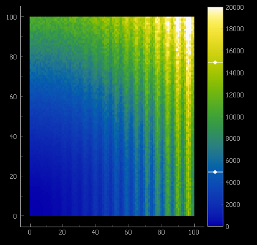
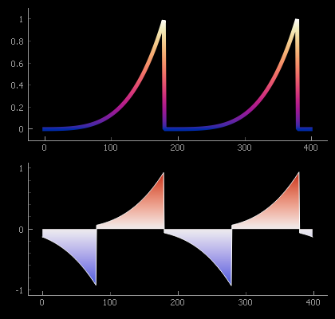

Color Maps
==========

A color map defines a relationship between scalar data values and a range of colors. Color maps are
commonly used to generate false color images, color scatter-plot points, and illustrate the height
of surface plots.

PyQtGraph's :class:`~pyqtgraph.ColorMap` can conveniently be applied to images and interactively 
adjusted by using :class:`~pyqtgraph.ColorBarItem`.
To provide interactively user-defined color mappings, see 
:class:`~pyqtgraph.GradientEditorItem` and :class:`~pyqtgraph.GradientWidget`, which wraps it.
:class:`~pyqtgraph.GradientEditorItem` combines the editing with a histogram and controls for
interactively adjusting image levels.

ColorMap can also be used a convenient source of colors from a consistent palette or to generate 
QPen and QBrush objects used to draw lines and fills that are colored according to their values 
along the horizontal or vertical axis.

Sources for color maps
----------------------

Color maps can be user defined by assigning a number of *stops* over the range of 0 to 1. A color
is given for each stop, and the in-between values are generated by interpolation.

When map colors directly represent values, an improperly designed map can obscure detail over
certain ranges of values, while creating false detail in others. PyQtGraph includes the
perceptually uniform color maps provided by the 
`Colorcet project <https://colorcet.holoviz.org/>`_. Color maps can also be imported from the 
``colorcet`` library or from ``matplotlib``, if either of these is installed.

To see all available color maps, please run the `ColorMap` demonstration available in the suite of
:ref:`examples`.

Examples
--------

False color display of a 2D data set. Display levels are controlled by 
a :class:`ColorBarItem <pyqtgraph.ColorBarItem>`:
    
.. literalinclude:: images/gen_example_false_color_image.py
    :lines: 18-28
    :dedent: 8
   
Using QtGui.QPen and QtGui.QBrush to color plots according to the plotted value:

.. literalinclude:: images/gen_example_gradient_plot.py
    :lines: 16-33
    :dedent: 8

The use of color maps is also demonstrated in the `ImageView`, `Color Gradient Plots` and `ColorBarItem` 
:ref:`examples`.

API Reference
-------------

.. autofunction:: pyqtgraph.colormap.listMaps

.. autofunction:: pyqtgraph.colormap.get

.. autofunction:: pyqtgraph.colormap.getFromMatplotlib

.. autofunction:: pyqtgraph.colormap.getFromColorcet

.. autoclass:: pyqtgraph.ColorMap
    :members:

    .. automethod:: pyqtgraph.ColorMap.__init__
