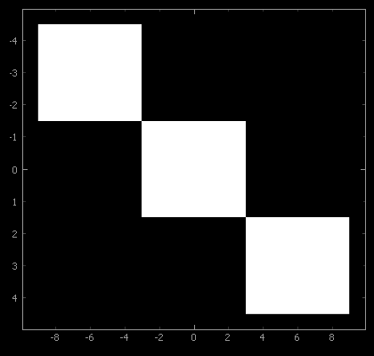

ImageItem
=========

:class:`~pyqtgraph.ImageItem` displays images inside a :class:`~pyqtgraph.GraphicsView`, or a 
:class:`~pyqtgraph.ViewBox`, which may itself be part of a :class:`~pyqtgraph.PlotItem`. It is designed
for rapid updates as needed for a video display. The supplied data is optionally scaled (see 
:func:`~pyqtgraph.ImageItem.setLevels`) and/or colored according to a
lookup table (see :func:`~pyqtgraph.ImageItem.setLookupTable`.

Data is provided as a NumPy array with an ordering of either

    * `col-major`, where the shape of the array represents (width, height) or
    * `row-major`, where the shape of the array represents (height, width).

While `col-major` is the default, `row-major` ordering typically has the best performance. In either ordering, 
a third dimension can be added to the array to hold individual
``[R,G,B]`` or ``[R,G,B,A]`` components.

Notes
-----

Data ordering can be set for each ImageItem, or in the :ref:`global configuration options <apiref_config>` by ::

    pyqtgraph.setConfigOption('imageAxisOrder', 'row-major') # best performance

An image can be placed into a plot area of a given extent directly through the
:func:`~pyqtgraph.ImageItem.setRect` method or the ``rect`` keyword. This is internally realized through
assigning a ``QtGui.QTransform``. For other translation, scaling or rotations effects that
persist for all later image data, the user can also directly define and assign such a 
transform, as shown in the example below. 

ImageItem is frequently used in conjunction with :class:`~pyqtgraph.ColorBarItem` to provide
a color map display and interactive level adjustments, or with
:class:`~pyqtgraph.HistogramLUTItem` or :class:`~pyqtgraph.HistogramLUTWidget` for a full GUI
to control the levels and lookup table used to display the image.

If performance is critial, the following points may be worth investigating:

    * Use row-major ordering and C-contiguous image data.
    * Manually provide ``level`` information to avoid autoLevels sampling of the image.
    * Prefer `float32` to `float64` for floating point data, avoid NaN values.
    * Use lookup tables with <= 256 entries for false color images.
    * Avoid individual level adjustments RGB components.
    * Use the latest version of NumPy. Notably, SIMD code added in version 1.20 significantly improved performance on Linux platforms.
    * Enable Numba with ``pyqtgraph.setConfigOption('useNumba', True)``, although the JIT compilation will only accelerate repeated image display.

.. _ImageItem_examples:

Examples
--------

.. literalinclude:: ../images/gen_example_imageitem_transform.py
    :lines: 19-28
    :dedent: 8

.. autoclass:: pyqtgraph.ImageItem
    :members:

    .. automethod:: pyqtgraph.ImageItem.__init__
