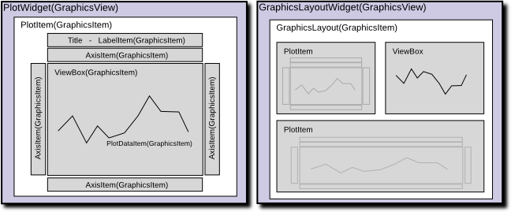

Plotting in pyqtgraph
=====================

There are a few basic ways to plot data in pyqtgraph: 

===================================================================     ==================================================
:func:`pyqtgraph.plot`                                                  Create a new plot window showing your data
:func:`PlotWidget.plot() <pyqtgraph.PlotWidget.plot>`                   Add a new set of data to an existing plot widget
:func:`PlotItem.plot() <pyqtgraph.PlotItem.plot>`                       Add a new set of data to an existing plot widget
:func:`GraphicsLayout.addPlot() <pyqtgraph.GraphicsLayout.addPlot>`     Add a new plot to a grid of plots
===================================================================     ==================================================

All of these will accept the same basic arguments which control how the plot data is interpreted and displayed:
    
* x - Optional X data; if not specified, then a range of integers will be generated automatically.
* y - Y data.
* pen - The pen to use when drawing plot lines, or None to disable lines.
* symbol - A string describing the shape of symbols to use for each point. Optionally, this may also be a sequence of strings with a different symbol for each point.
* symbolPen - The pen (or sequence of pens) to use when drawing the symbol outline.
* symbolBrush - The brush (or sequence of brushes) to use when filling the symbol.
* fillLevel - Fills the area under the plot curve to this Y-value.
* brush - The brush to use when filling under the curve.
    
See the 'plotting' :ref:`example <examples>` for a demonstration of these arguments.
    
All of the above functions also return handles to the objects that are created, allowing the plots and data to be further modified.

Organization of Plotting Classes
--------------------------------

There are several classes invloved in displaying plot data. Most of these classes are instantiated automatically, but it is useful to understand how they are organized and relate to each other. PyQtGraph is based heavily on Qt's GraphicsView framework--if you are not already familiar with this, it's worth reading about (but not essential). Most importantly: 1) Qt GUIs are composed of QWidgets, 2) A special widget called QGraphicsView is used for displaying complex graphics, and 3) QGraphicsItems define the objects that are displayed within a QGraphicsView.

* Data Classes (all subclasses of QGraphicsItem)
    * :class:`PlotCurveItem <pyqtgraph.PlotCurveItem>`  - Displays a plot line given x,y data
    * :class:`ScatterPlotItem <pyqtgraph.ScatterPlotItem>`   - Displays points given x,y data
    * :class:`PlotDataItem <pyqtgraph.PlotDataItem>` - Combines PlotCurveItem and ScatterPlotItem. The plotting functions discussed above create objects of this type.
* Container Classes (subclasses of QGraphicsItem; contain other QGraphicsItem objects and must be viewed from within a GraphicsView)
    * :class:`PlotItem <pyqtgraph.PlotItem>` - Contains a ViewBox for displaying data as well as AxisItems and labels for displaying the axes and title. This is a QGraphicsItem subclass and thus may only be used from within a GraphicsView
    * :class:`GraphicsLayout <pyqtgraph.GraphicsLayout>`  - QGraphicsItem subclass which displays a grid of items. This is used to display multiple PlotItems together.
    * :class:`ViewBox <pyqtgraph.ViewBox>`  - A QGraphicsItem subclass for displaying data. The user may scale/pan the contents of a ViewBox using the mouse. Typically all PlotData/PlotCurve/ScatterPlotItems are displayed from within a ViewBox.
    * :class:`AxisItem <pyqtgraph.AxisItem>`  - Displays axis values, ticks, and labels. Most commonly used with PlotItem.
* Container Classes (subclasses of QWidget; may be embedded in PyQt GUIs)
    * :class:`PlotWidget <pyqtgraph.PlotWidget>`  - A subclass of GraphicsView with a single PlotItem displayed. Most of the methods provided by PlotItem are also available through PlotWidget.
    * :class:`GraphicsLayoutWidget <pyqtgraph.GraphicsLayoutWidget>` - QWidget subclass displaying a single GraphicsLayoutItem. Most of the methods provided by GraphicsLayoutItem are also available through GraphicsLayoutWidget.
    

Examples
--------

See the 'plotting' and 'PlotWidget' :ref:`examples included with pyqtgraph <examples>` for more information.

Show x,y data as scatter plot::
    
    import pyqtgraph as pg
    import numpy as np
    x = np.random.normal(size=1000)
    y = np.random.normal(size=1000)
    pg.plot(x, y, pen=None, symbol='o')  ## setting pen=None disables line drawing

Create/show a plot widget, display three data curves::
    
    import pyqtgraph as pg
    import numpy as np
    x = np.arange(1000)
    y = np.random.normal(size=(3, 1000))
    plotWidget = pg.plot(title="Three plot curves")
    for i in range(3):
        plotWidget.plot(x, y[i], pen=(i,3))  ## setting pen=(i,3) automaticaly creates three different-colored pens
    

