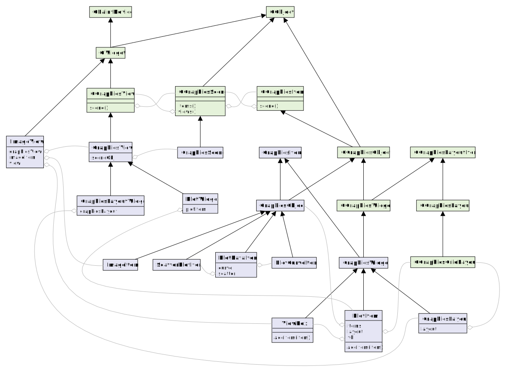

UML class diagram
=================

.. _uml_diagram:

The UML class diagram below gives an overview of the most important classes and their relations.

The green boxes represent Qt classes, the purple boxes are PyQtGraph classes.

The black arrows indicate inheritance between two classes (with the parent class always above the child classes.)

The gray lines with the diamonds indicate an aggregation relation. For example the :class:`PlotDataItem <pyqtgraph.PlotDataItem>` class has a ``curve`` attribute that is a reference to a :class:`PlotCurveItem <pyqtgraph.PlotCurveItem>` object.

